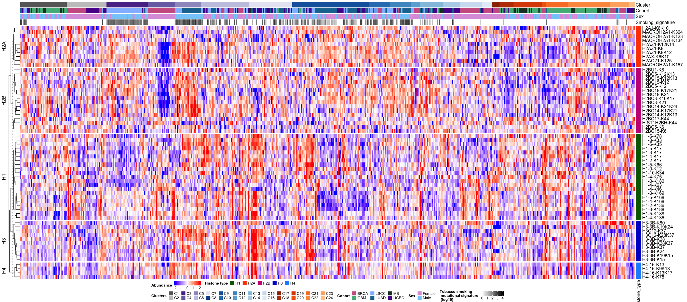

00_overview_of_histone_acetylation_across_clusters Figure5A
================

# 0. Load library

``` r
library(tidyverse)
library(ComplexHeatmap)
library(circlize)
```

# 1.Prepare metadata

``` r
Histone_genes_curated <- read.delim("./data/Histone_genes_curated_final.tsv")%>% filter(grepl('H1|H2A|H2B|H3|H4', gene_type))
acetylome_meta_data <- read.delim("./data/acetylome_meta_data.tsv")%>%filter(grepl('BRCA|LSCC|MEDUL|GBM|LUAD|UCEC|MB', cohort))
mappings_pancan <- read.delim("./data/cluster_map.tsv")
case_mapping <-mappings_pancan %>%right_join(acetylome_meta_data%>%dplyr::select(case_id,cohort,age,sex,race,smoking),by="case_id")%>%filter(!is.na(cluster_id))

head(Histone_genes_curated)
```

    ##      hgnc_id geneSymbol                                             name
    ## 1  HGNC:4714       H1-0                              H1.0 linker histone
    ## 2  HGNC:4715       H1-1              H1.1 linker histone, cluster member
    ## 3  HGNC:4722      H1-10                             H1.10 linker histone
    ## 4 HGNC:19163     H1-12P H1.12 linker histone, cluster member, pseudogene
    ## 5  HGNC:4716       H1-2              H1.2 linker histone, cluster member
    ## 6  HGNC:4717       H1-3              H1.3 linker histone, cluster member
    ##    gene_group main_gene_group gene_type                locus_type   status
    ## 1 H1 histones              H1        H1 gene with protein product Approved
    ## 2 H1 histones              H1        H1 gene with protein product Approved
    ## 3 H1 histones              H1        H1 gene with protein product Approved
    ## 4 H1 histones              H1        H1                pseudogene Approved
    ## 5 H1 histones              H1        H1 gene with protein product Approved
    ## 6 H1 histones              H1        H1 gene with protein product Approved
    ##   location location_sortable              alias_symbol
    ## 1  22q13.1           22q13.1                      H1.0
    ## 2   6p22.2           06p22.2                  H1.1|H1a
    ## 3   3q21.3           03q21.3      MGC15959|MGC8350|H1X
    ## 4   6p22.2           06p22.2 dJ34B20.16|FLJ39701|H1F6P
    ## 5   6p22.2           06p22.2            H1.2|H1s-1|H1c
    ## 6   6p22.2           06p22.2            H1.3|H1d|H1s-2

``` r
head(acetylome_meta_data)
```

    ##     case_id cohort age    sex                      race              ethnicity
    ## 1 CPT000814   BRCA  41 Female Black or African American                Unknown
    ## 2 CPT001846   BRCA  84 Female                     White                Unknown
    ## 3  X01BR001   BRCA  55 Female Black or African American Not Hispanic or Latino
    ## 4  X01BR008   BRCA  48 Female Black or African American Not Hispanic or Latino
    ## 5  X01BR009   BRCA  64 Female Black or African American Not Hispanic or Latino
    ## 6  X01BR010   BRCA  65 Female Black or African American Not Hispanic or Latino
    ##   inferred_ancestry_based_on_genomic_data hrd_biry mmrd_biry mutatiol_sigture
    ## 1                                 African        0         0             <NA>
    ## 2                                European        1         0              HRD
    ## 3                                 African        0         0             <NA>
    ## 4                                    <NA>        0         0             <NA>
    ## 5                                    <NA>        1         0              HRD
    ## 6                                    <NA>        0         0             <NA>
    ##   pole pole_msi cp_g_t_short_indels       apobec    cp_g_t mmrd
    ## 1    0        0                   0 5.096583e+01 26.120914    0
    ## 2    0        0                   0 1.895067e+01 28.455810    0
    ## 3    0        0                   0 1.120000e-43 32.195420    0
    ## 4    0        0                   0 6.502066e+01 15.362890    0
    ## 5    0        0                   0 2.173434e+01  5.264023    0
    ## 6    0        0                   0 6.823524e+00 11.506860    0
    ##   unknown_sbs8_0_64 tobacco_smoking uv_exposure      hrd
    ## 1                 0               0           0 1.123502
    ## 2                 0               0           0 1.718708
    ## 3                 0               0           0 1.626216
    ## 4                 0               0           0 1.071425
    ## 5                 0               0           0 1.975118
    ## 6                 0               0           0 1.562472
    ##   nhr1_unknown_sbs40_0_94 smoking
    ## 1                       0       0
    ## 2                       0       0
    ## 3                       0       0
    ## 4                       0       0
    ## 5                       0       0
    ## 6                       0       0

``` r
head(case_mapping)
```

    ##       case_id cluster_id cohort age    sex    race  smoking
    ## 1   C3L.00080         C1   LUAD  58   Male   White 2.897781
    ## 2   C3N.00217         C1   LUAD  59 Female Unknown 2.888151
    ## 3 C3L.00006.T         C1   UCEC  64 Female   White 0.000000
    ## 4   C3L.03678         C1   LSCC  49   Male   White 2.596809
    ## 5   C3N.02284         C1   LSCC  69   Male Unknown 2.674412
    ## 6   C3L.00993         C1   LSCC  75   Male Unknown 2.094367

# 2.Prepare acetylome data matrix

``` r
# acetylome
acetylome_imputed <-read.delim(file = "./data/acetylome_imputed.tsv",sep="\t")

# list histone genes
acetylation_gene <-Histone_genes_curated$geneSymbol

# acetylation matrix of histone genes H1-H4
histone.acetylome_imputed <-acetylome_imputed %>% filter(geneSymbol %in% acetylation_gene)

histone.acetylome_imputed <-Histone_genes_curated%>%dplyr::select(geneSymbol,gene_type)%>%right_join(histone.acetylome_imputed,by="geneSymbol")
```

# 3. Generate annotation file and data matrix for the heatmap

``` r
hist_site_anno<-histone.acetylome_imputed %>% dplyr::select(acetyl_sites,gene_type)

hist_map_acetyl<-case_mapping%>%left_join(t(histone.acetylome_imputed[,-c(1,2,4,5,6)]%>%column_to_rownames(var ="acetyl_sites"))%>%as.data.frame%>%rownames_to_column(var = "case_id"),by="case_id")

hist_mat_acetyl<-as.data.frame(scale(hist_map_acetyl[,-c(1:7)]))
```

# 4. Plot Fig5A

``` r
out_dir = './figures/'
col_fun = colorRamp2(c(-2, 0, 2), c("blue", "white", "red"))
col_smoke = colorRamp2(c(0, 2, 4), c("white", "#999999", "#000000"))
col_cluster<-c("C1"="#686868",
               "C2"="#c6c6c6",
               "C3"="#5b3495",
               "C4"="#796eb2",
               "C5"="#9e9ac8",
               "C6"="#c6c7e1",
               "C7"="#e8e7f2",
               "C8"="#084a91",
               "C9"="#1764ab",
               "C10"="#2e7ebc",
               "C11"="#4a98c9",
               "C12"="#6aaed6",
               "C13"="#94c4df",
               "C14"="#b7d4ea",
               "C15"="#d0e1f2",
               "C16"="#e3eef9",
               "C17"="#9b3203",
               "C18"="#bd3e02",
               "C19"="#dd4d04",
               "C20"="#ef6612",
               "C21"="#f9802d",
               "C22"="#fd994d",
               "C23"="#fdb170",
               "C24"="#fdca99"
)

h = Heatmap(hist_mat_acetyl %>% t,
            col=col_fun,
            cluster_columns = FALSE,
            name='Abundance',
            top_annotation=columnAnnotation(Cluster=factor(hist_map_acetyl$cluster_id,levels = c("C1","C2","C3","C4","C5","C6","C7","C8","C9","C10","C11","C12","C13","C14","C15","C16","C17","C18","C19","C20","C21","C22","C23","C24")),
                                            Cohort=hist_map_acetyl$cohort,
                                            Sex=as.character(hist_map_acetyl$sex),
                                            Smoking_signature=hist_map_acetyl$smoking,
                                            col=list(Cluster=col_cluster,
                                                     Cohort=c("GBM"="#52b788", "MB"="#193e2e", "LSCC"="#91bdff", "LUAD"="#1a759f", "UCEC"="#5a189a", "BRCA"="#cd6090"),Cluster=col_cluster,
                                                     Sex=c("Male"="lightskyblue", "Female"="plum"),
                                                     Smoking_signature = col_smoke),
                                            annotation_legend_param = list(Cohort = list(nrow = 2, title = "Cohort", title_position = "leftcenter"),
                                                                           Cluster = list(nrow = 2, title = "Clusters", title_position = "leftcenter"),
                                                                           Sex = list(nrow = 2, title = "Sex", title_position = "leftcenter"),
                                                                           Smoking_signature= list(title = "Tobacco smoking \n mutational signature \n (log10)", title_position = "leftcenter",direction = "horizontal")
                                            )),
            right_annotation=rowAnnotation(Histone_type=hist_site_anno$gene_type,  
                                           annotation_legend_param = list(Histone_type = list(nrow = 1, title = "Histone type", title_position = "lefttop")),
                                           col=list(Histone_type=c("H1"="darkgreen", "H2A"="orangered", "H2B"="mediumvioletred", "H3"="mediumblue", "H4"="dodgerblue"))),
            row_split=hist_site_anno$gene_type, 
            heatmap_legend_param = list(direction='horizontal', title_position='leftcenter'),
            cluster_column_slices = F,
            show_row_names=T)

# plot heatmap
draw(h,annotation_legend_side='bottom', heatmap_legend_side='bottom')
```

<!-- -->

``` r
#save heatmap to Fig5A.pdf
pdf(paste0(out_dir, 'Fig5A.pdf'), width=25, height=11)
draw(h,annotation_legend_side='bottom', heatmap_legend_side='bottom')
dev.off()
```

    ## quartz_off_screen 
    ##                 2
