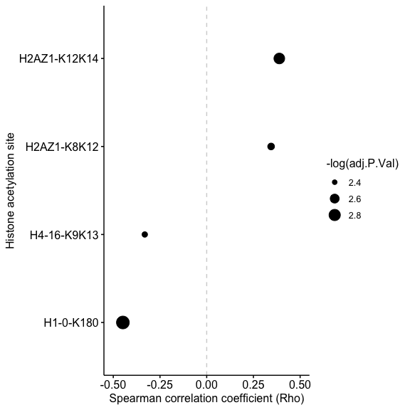
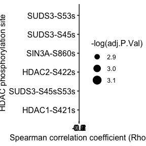
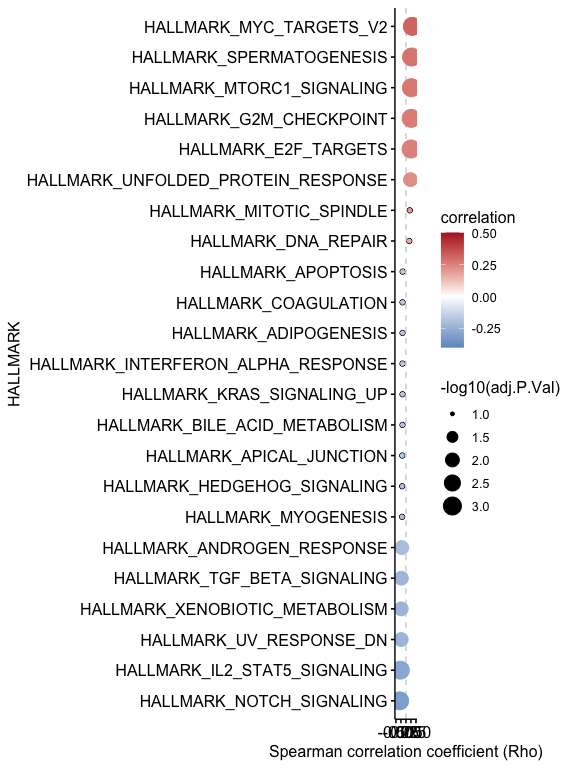

03_plot_smoking_associated_event
================

# 0. Load library

``` r
library(tidyverse)
library(circlize)
library(cowplot)
library(ggpubr)
```

# 1. Smoking and histone acetylation change

``` r
acetyl <- read.delim("./data/luad_smoke_histone_acetylation_spearman_with_canonical_v2.tsv")
colnames(acetyl)[1]<-"id"
acetyl_map_full <- read.delim("./data/var_map_full_v4.tsv") %>% filter(feature=="acetylome") %>% separate(causalpath_adjusted_id, sep = "_",c(NA, NA,"ptm_sites"),extra = "drop")%>%
  mutate(ptm_sites = str_replace_all(ptm_sites, 
                                     pattern = "k", replacement = ""),
         acetyl_sites=paste0(geneSymbol,"-",ptm_sites))%>%
  dplyr::select(acetyl_sites,everything())

acetyl<-acetyl %>% left_join(acetyl_map_full[,c(1,2)],by="id")

s5b<-acetyl %>% filter(adj.P.Val<=0.1) %>% arrange(corr)
data<-s5b
FigS5b <- ggdotchart(data, x="acetyl_sites", y = "corr",
                  sorting = "none",
                  dot.size =-log(data$adj.P.Val),
                  ylab = "Spearman correlation coefficient (Rho)",
                  xlab = "Histone acetylation site",
                  rotate = TRUE,
                  font.label = list(color = "white", size = 11, 
                                    vjust = 0.5),               # Adjust label parameters
                  ggtheme = theme_pubr()                        # ggplot2 theme
)+ylim(-0.5, 0.5)+
  geom_hline(yintercept = 0, linetype = 2, color = "lightgray")+ geom_point(aes(size = -log(adj.P.Val)))+ theme(legend.position="right")

## Plot FigS5B
print(FigS5b)
```

<!-- -->

``` r
## Save FigS5B 
out_dir = './figures/'
pdf(paste(out_dir,"FigS5B.pdf",sep=""), onefile=TRUE,width=6, height=6)
print(FigS5b)
dev.off()
```

    ## quartz_off_screen 
    ##                 2

# 2. Smoking and HDAC phosphorylation change

``` r
phospho <- read.delim("./data/luad_smoke_hdac_phospho_res_spearman_v2.tsv")
colnames(phospho)[1]<-"id"
phospho_map_full <- read.delim("./data/var_map_full_v4.tsv") %>% filter(feature=="phosphoproteome") %>% separate(causalpath_adjusted_id, sep = "_",c(NA, NA,"ptm_sites"),extra = "drop")%>%
  mutate(phospho_sites=paste0(geneSymbol,"-",ptm_sites))%>%
  dplyr::select(phospho_sites,everything())

phospho<-phospho %>% left_join(phospho_map_full[,c(1,2)],by="id")

s5c<-phospho %>% filter(adj.P.Val<=0.1) %>% arrange(corr)
data<-s5c

FigS5c <- ggdotchart(data, x="phospho_sites", y = "corr",
                  sorting = "none",
                  dot.size =-log(data$adj.P.Val),
                  ylab = "Spearman correlation coefficient (Rho)",
                  xlab = "HDAC phosphorylation site",
                  rotate = TRUE,
                  font.label = list(color = "white", size = 11, 
                                    vjust = 0.5),               # Adjust label parameters
                  ggtheme = theme_pubr()                        # ggplot2 theme
)+    
  ylim(-0.4, 0.6)+
  geom_hline(yintercept = 0, linetype = 2, color = "lightgray")+ geom_point(aes(size = -log(adj.P.Val)))+ theme(legend.position="right")

## Plot FigS5C
print(FigS5c)
```

<!-- -->

``` r
## Save FigS5C
out_dir = './figures/'
pdf(paste(out_dir,"FigS5C.pdf",sep=""), onefile=TRUE,width=6, height=6)
print(FigS5c)
dev.off()
```

    ## quartz_off_screen 
    ##                 2

# 3. Smoking and HALLMARK Pathways

``` r
smoking_gsea_corr <-read.delim("./data/smoking_gsea_corr_v2.tsv")%>%rename(correlation=corr)%>%arrange(correlation)

colnames(smoking_gsea_corr)[1]<-"HALLMARK"

smoking_gsea_corr$logp <- -log10(smoking_gsea_corr$adj.P.Val)

smoking_gsea_corr<-smoking_gsea_corr%>% 
  mutate('-log10(adj.P.Val)' = case_when(
    logp <1.3 & logp >0 ~ 1,
    logp <=2 & logp >1 ~ 2,
    logp <=3 & logp >2 ~ 3,
    #logp >3.5 ~ 4,
    logp <=4 & logp >3 ~ 4,
    logp <=5 & logp >4 ~ 5,
    logp <=6.5 & logp >5 ~ 6,
  ))


FigS5D <-ggdotchart(smoking_gsea_corr %>% filter(adj.P.Val<=0.1), x="HALLMARK", y = "correlation",
                sorting = "none",
                ylab = "Spearman correlation coefficient (Rho)",
                rotate = TRUE,
                font.label = list(color = "white", size = 11, 
                                  vjust = 0.5),               # Adjust label parameters
                ggtheme = theme_pubr()                        # ggplot2 theme
)+ylim(-0.5, 0.5)+
  geom_hline(yintercept = 0, linetype = 2, color = "lightgray")+ geom_point(aes(size=`-log10(adj.P.Val)`,color=correlation))+ theme(legend.position="right") +scale_color_gradient2(midpoint=0, low="#4281BB", mid="white",high="#B21F2C", space ="Lab",limits = c(-0.4,0.5))

## Plot FigS5D
print(FigS5D)
```

<!-- -->

``` r
## Save FigS5D
out_dir = './figures/'
pdf(paste(out_dir,"FigS5D.pdf",sep=""), onefile=TRUE,width=8, height=6)
print(FigS5D)
dev.off()
```

    ## quartz_off_screen 
    ##                 2
